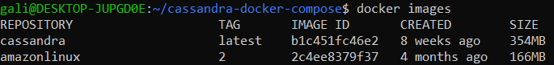

## Задание:
Создать *Docker Compose* скрипт для развертки кластера из трех инстансов cassandra, причем каждый из них должен быть доступен из основной (локальной) сети по отдельному ip адресу.


- На машине А (ubuntu 22.04 lts) в локальной сети с ip 192.168.1.197 запускается скрипт docker-compose для поднятия 3 образов с ip адресами 192.168.1.200-202.
- Затем с машины Б (ubuntu 22.04 lts) из той же локальной сети с ip 192.168.1.198 необходимо подключиться через *cqlsh* к каждой из машин-образов.
- Все приведённые операции необходимо задокументировать и описать инструкцией с командами и объяснениями в Readme
- Добавить скриншот результата в Readme.

----

**Прежде чем начать** необходимо скопировать данный репозиторий: `git clone https://github.com/GAidaraliev/Cassandra-cluster-with-docker-compose.git`

- В первую очередь необходимо запустить скрипт *Docker Compose* в терминале машины А для поднятия 3 инстансов следующей командой: `docker-compose up`
- Далее посмотреть собранный образ и статус запущенных контейнеров cassandra, чтобы убедиться, что все запустилось правильно: 
````
docker images
````

````
docker-compose ps
````


- После этого можно посмотреть статус работы cassandra в docker ({n} - номер нода)
````
docker exec cassandra-{n} nodetool status 
````

*Признаюсь у меня здесь немного больше времени забрало, чем я предполагал, так как я ожидал увидеть каждую ноду с всеми тремя ip адрессами, но пересмотрев и перепробовав различные способы, так и не смог найти решение к данной проблеме.* 

- Далее я полагаю, можно подключиться из машины Б для создание CQL запросов в БД кластера Cassandra изнутри, используя следующую команду:
````
docker exec -ti {name of node} cqlsh {IP node}
````


- После тестирования кластера в Docker Compose, можно остановить и удалить созданные контейнеры с помощью команды `docker-compose down`
